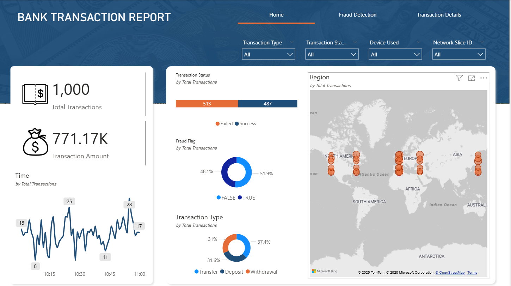

# 🏦 Bank Transaction Report – Power BI Dashboard

## ✅ Screenshots

### **Dashboard Overview**

---

## 📊 Project Overview

The **Bank Transaction Report** is an interactive Power BI dashboard designed to monitor and analyze banking transactions, detect fraudulent activity, and provide detailed transaction insights. It gives users a comprehensive view of transaction patterns, fraud distribution, and network slice performance.

This report helps financial analysts and compliance teams efficiently track transaction trends and fraud indicators across different regions, devices, and transaction types.

---

## 🚀 Key Features

### **1️⃣ Home Page – Transaction Overview**

* Displays key **KPIs** such as:

  * **Total Transactions**
  * **Total Transaction Amount**
* Shows **Transaction Trends** over time.
* **Transaction Status Split:** Failed vs. Successful transactions.
* **Fraud Flag Distribution:** True vs. False (Fraud vs. Legitimate).
* **Transaction Type Breakdown:** Transfer, Deposit, Withdrawal.
* **Region Map:** Global view of transactions across continents.

---

### **2️⃣ Fraud Detection Page**

* Focuses specifically on **fraudulent transactions**.
* Visualizes:

  * **Bandwidth Group Distribution** (e.g., 50–100 Mbps, 150–250 Mbps).
  * **Network Slice Analysis** (Slice 1, Slice 2, Slice 3).
  * **Fraudulent Transactions by Region.**
* Helps identify potential network-based anomalies or bandwidth patterns linked to fraud.

---

### **3️⃣ Transaction Details Page (Drill-through)**

* A **drill-through page** that displays detailed data for each transaction selected from the main pages.
* Includes:

  * Transaction ID, Sender & Receiver Account IDs
  * Transaction Type & Amount
  * Fraud Flag (TRUE/FALSE)
  * Transaction Status (Success/Failed)
  * Bandwidth Group and Network Slice
* Provides granular visibility for **fraud investigation or audit teams**.

---

## 🧠 Insights Gained

* Identify countries and regions with **higher fraud occurrences**.
* Detect **bandwidth patterns** commonly associated with fraudulent activities.
* Analyze **success vs. failure rates** of transactions by type.
* Investigate individual **fraud cases through drill-through** navigation.

---

## 🧩 Tools & Technologies Used

* **Power BI Desktop**
* **Data Modeling:** DAX, Relationships, Filters
* **Visualization:** KPI Cards, Donut Charts, Maps, Bar Charts, Line Charts
* **Drill-through & Interactivity:** Buttons, Page Navigation, Dynamic Filters

---

## 📁 Project Pages Summary

| Page Name               | Purpose                                          |
| ----------------------- | ------------------------------------------------ |
| **Home**                | Overall transaction summary & regional trends    |
| **Fraud Detection**     | Analyze fraudulent transaction distribution      |
| **Transaction Details** | Drill-through page for transaction-level details |

---

## ⚙️ Data Source

* Simulated banking transaction dataset
* Contains attributes like:

  * `Transaction ID`, `Sender Account ID`, `Receiver Account ID`,
    `Transaction Type`, `Transaction Amount`, `Fraud Flag`,
    `Transaction Status`, `Bandwidth Group`, `Network Slice`, and `Region`

---

## 🔗 Connect with Me

👤 **Sayed Ibrahim M**
📎 [LinkedIn Profile](https://www.linkedin.com/in/sayed-ibrahim-m)
